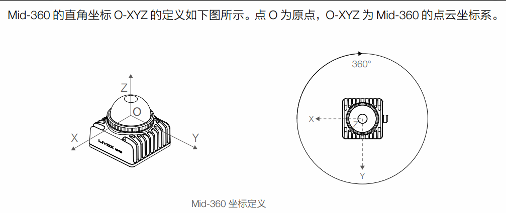

# 哨兵导航（2024赛季）

## 开发环境

1. ubuntu 20.04 [安装教程](https://blog.csdn.net/qq_42257666/article/details/123709678)（或者自己找教程，流程差不多）。
2. ROS1 noetic [学习视频（内含安装教程）](https://www.bilibili.com/video/BV1Ci4y1L7ZZ/) [他的文档](http://www.autolabor.com.cn/book/ROSTutorials/)  或者找  [鱼香ROS一键安装](http://fishros.com/)。

---

由于20.04仅维护至2025年，所以未来哨兵的开发方向肯定是要使用更高版本的ubuntu以及相对应的ros2，本技术文档仅讨论ros1下2024以实现的烧饼导航功能，希望能给到读者一些填坑或者启发作用。

代码地址：[weekleaf/awakelion_sentry](https://github.com/weekleaf/awakelion_sentry)

## 具体实现

### 1. mid-360激光雷达驱动

* step 1

  连接mid-360前，将电脑设置为静态IP，IP设置为：192.168.1.50，子网掩码设置为：255.255.255.0

* step  2

  安装Livox-SDK2：

  ```
  git clone https://github.com/Livox-SDK/Livox-SDK2.git
  cd ./Livox-SDK2/
  mkdir build
  cd build
  cmake .. && make -j8
  sudo make install
  ```

  安装livox_ros_driver2：

  ```
  git clone https://github.com/Livox-SDK/livox_ros_driver2.git ws_livox/src/livox_ros_driver2
  source /opt/ros/noetic/setup.sh
  ./build.sh ROS1
  ```

  >注意：mid-360使用[*SDK2*](https://github.com/Livox-SDK/Livox-SDK2)和[*livox_ros_driver2*](https://github.com/Livox-SDK/livox_ros_driver2)并非*SDK*和*livox_ros_driver*

* step 3

  下载[Livox Viewer2](https://www.livoxtech.com/downloads)
  `./livox viewer2.sh`运行Livox Viewer2（注意ip设置是否正确）

* step 4

  更改`livox_ros_driver2/config/MID360_config.json`配置文件，将host IP和lidar IP改为主机ip即192.168.1.50与雷达IP（注意雷达ip需要启动viewer2看命令行打印出的雷达ip，而并非sn码后两位！！！）

* step 5

  启动mid-360

  ```
  roslaunch livox_ros_driver2 rviz_MID360.launch
  roslaunch livox_ros_driver2 msg_MID360.launch
  ```

  注意查看话题消息：

  ```
  rostopic list
  ```

---

参考教程：

[Livox-mid-360激光雷达ip配置](https://blog.csdn.net/Hahalim/article/details/129414327)

[Ubuntu20.04 配置静态IP1](https://zhuanlan.zhihu.com/p/474644849)

[Ubuntu20.04 配置静态IP2](https://blog.csdn.net/weixin_53000184/article/details/130780912)

[网卡配置常见问题](https://blog.csdn.net/weixin_39928446/article/details/120143698)

### 2. 雷达驱动配置

雷达坐标定义如下：



* 点云外参配置

  一般雷达在车上的姿态并非都是正装，会有各种姿态甚至倒装的情况，故需要配置外参，雷达的点云外参矫正可以使用livox_viewer2的外参标定工具可视化标定外参，调整角度使点云是正的，记录下参数，填入config中，例如本赛季雷达向前倾斜40度安装：

  ```
  "lidar_configs" : [
      {
        "ip" : "192.168.1.3",
        "pcl_data_type" : 1,
        "pattern_mode" : 0,
        "extrinsic_parameter" : {
          "roll": 0.0,
          "pitch": 40.0,
          "yaw": 0.0,
          "x": 0,
          "y": 0,
          "z": 0
        }
      }
    ]
  ```

1，2部分对应代码中的[livox_ros_driver2](https://github.com/weekleaf/awakelion_sentry/tree/master/src/livox_ros_driver2)包

---

### 3. [FAST_LIO](https://github.com/hku-mars/FAST_LIO) & [Point_LIO](https://github.com/hku-mars/Point-LIO)（里程计算法）

* step 1

  安装pcl库：

  ```
  sudo apt install libpcl-dev
  ```

* step 2

  安装eigen库：
  到[eigen官网](http://eigen.tuxfamily.org/index.php?title=Main_Page)下载相应版本
  编译安装

  ~~~
  mkdir build
  cd build
  cmake ..
  sudo make install
  ~~~

* step 3

  LIO的编译安装看github

* step 4

  启动LIO跑launch即可（需要先跑雷达驱动的`msg_MID360.launch`,该launch会以自定义格式发布点云消息，而这两个LIO算法正需要接收这种格式的topic）

### 4. 雷达外参配置

不同安装方式的雷达不仅需要改驱动内点云的角度，还需要改Point_LIO中的外参矩阵，如前例雷达安装角度为pitch旋转40度，使用[欧拉角计算器]()[3D Rotation Converter (andre-gaschler.com)](https://www.andre-gaschler.com/rotationconverter/)可以算出对应的矩阵（此处因为点云通过前面配置已经调正为不倾斜状态，LIO算法需要点云与IMU配准，故需要将雷达IMU也调正为不倾斜，旋转矩阵应实现反向旋转40度即旋转-40度）。

在config/mid360.yaml配置的旋转外参矩阵如下：

```
extrinsic_R: [  0.7660,  0.0,  -0.6428,
      			0.0,  1.0,  0.0,
  				0.6428,  0.0,  0.7660]
```

重力矩阵：

```
#若雷达正装则设置重力的矩阵为[0.0, 0.0, -9.8]反装则设置为[0.0, 0.0, 9.8]
gravity: [0.0, 0.0, -9.800291] 
gravity_init: [0.0, 0.0, -9.810] 
```

平移矩阵：

```
#RM官方在2023年给出的哨兵导航开源包中Fast-lio的yaml文件中外参是[-0.011, -0.0234, 0.044]
extrinsic_T: [-0.011, -0.0234, 0.044]
```

3，4部分对应代码中的[FAST_LIO](https://github.com/weekleaf/awakelion_sentry/tree/master/src/FAST_LIO)和[Point-LIO](https://github.com/weekleaf/awakelion_sentry/tree/master/src/Point-LIO)包

### 5. Point_LIO自定义消息转发包

可以将Point_LIO的自定义消息转发成规划需要的PointCloud2格式，默认转发出的topic名称为：

```
pub_pcl_out1 = nh.advertise<sensor_msgs::PointCloud2>("/livox_pcl0", 100);
```

详见代码[livox_repub](https://github.com/weekleaf/awakelion_sentry/tree/master/src/livox_repub)

### 6. 里程计转发节点

此节点用于发布雷达初始系（代码一跑起来设定的静止系）camera_init（不变系）并非雷达实时系aft_mapped到底盘或者说是云台系base_link系的变换以及计算里程计发布到名为odom的topic，用于导航，代码中有详细的注释不在此赘述，具有线代基础并慢慢思考便可明白其意思。

```
#此处为平移向量，根据雷达安装位置到云台中心的偏移填入
float trans_x = -0.12832, trans_y = -0.08874, trans_z = -0.1543;
// float rot_w = 1, rot_x = 0.0, rot_y = -0.0, rot_z = 0.0;
#此处为旋转矩阵，与里程计配置的旋转外参相同，转换成四元数即可
float rot_w = 0.9277, rot_x = 0.0, rot_y = -0.3732, rot_z = 0.0;
```

此部分对应代码中[odom_trans.cpp](https://github.com/weekleaf/awakelion_sentry/blob/master/src/sentry_navigation/src/odom_trans.cpp)文件

### 7. 路径规划部分

使用ros官方集成的navigation功能包集，规划框架使用move_base，全局路径规划算法使用dijkstra（若使用A*算法需要将use_grid_path设为true），局部路径规划使用eband_local_planner。在学习ros途中都会学习到导航的具体实现，此部分不赘述，详见代码[sentry_navigation](https://github.com/weekleaf/awakelion_sentry/tree/master/src/sentry_navigation)与[navigation](https://github.com/weekleaf/awakelion_sentry/tree/master/src/navigation)。

### 8. 点云地面分割

由于斜装的雷达会将地面视为障碍物，故需要做地面与非地面的区分，此处采用开源算法depth_clustering，此算法可调参数较少（我也没看完其代码），本人没法通过此算法实现哨兵上坡（据其他战队说法既有魔改地面分割算法实现也有使用grid_map实现烧饼上坡，这也是未来哨兵需要实现的一部分），还有许多不同算法可以考虑，可以多百度/bing/google查找资料，此处详见代码中[depth_clustering_ros](https://github.com/weekleaf/awakelion_sentry/tree/master/src/depth_clustering_ros)部分。

```
point_pub = nh.advertise<sensor_msgs::PointCloud2>("cluster_result", 1);//障碍物点云
ground_pub = nh.advertise<sensor_msgs::PointCloud2>("ground_result", 1);//地面点云
```

### 9. 其余部分

* 通信

  使用topic通信，使用ros官方的serial包，详见代码[serial](https://github.com/weekleaf/awakelion_sentry/tree/master/src/serial)，具体实现由郭光翀完成，详见代码[robot_driver](https://github.com/weekleaf/awakelion_sentry/tree/master/src/robot_driver)，以及自定义通信消息[RMUC_msgs](https://github.com/weekleaf/awakelion_sentry/tree/master/src/RMUC_msgs)（包含决策消息）

* 决策树

  由郭光翀与邓锦桦完成，详见代码[RMUC_Decision](https://github.com/weekleaf/awakelion_sentry/tree/master/src/RMUC_Decision)

* 自瞄

  详见[auto_aim](https://github.com/weekleaf/awakelion_sentry/tree/master/src/auto_aim)

  **！！！注意：老自瞄框架（代码内的auto_aim）与导航部分在同一工作空间下编译会导致自瞄无法运行的玄学问题，故先前是通过不同工作空间下编译再分别执行的方式运行的！！！**

  本赛季为实现自瞄在ros上的通信，所做的工作仅只是把自瞄移植到ros框架上，改变了通信方式，但自瞄的角度解算并没有使用上tf，而是老一套的eigen。烧饼框架上的自瞄有些许问题是下赛季急需改进的，上赛季在角度解算上理论与实现有出入，未来应不再沿用，仅移植通信思路可参考：

  1. 采用简单的topic实现，将串口通信一整个大的环节分开为下位机串口通信节点即robot_driver与其他节点，不再像老代码一样将串口通信写入上位机算法内，只需要上位机算法处理的消息写成topic话题发出，robot_driver接收并发送到下位机即可，同样，robot_driver可通过接收到的下位机数据发送到自定义的topic上，供上位机算法接收即可。

     自瞄部分topic接收与发送：
  
     ```
     //定义发布者与订阅者
     ros::Publisher vision_pub;
     ros::Subscriber vision_sub;
     robot_driver::vision_tx_data pc_recv_mesg;
     robot_driver::vision_rx_data pc_send_mesg;
     //订阅的回调函数
     void visionCallback(const robot_driver::vision_rx_data::ConstPtr &msg){
         pc_send_mesg.bullet_level = msg->bullet_level;
         pc_send_mesg.direction = msg->direction;
         pc_send_mesg.robot_color = msg->robot_color;
         pc_send_mesg.robot_pitch = msg->robot_pitch;
         pc_send_mesg.robot_yaw = msg->robot_yaw;
         pc_send_mesg.task_mode = msg->task_mode;
         pc_send_mesg.time_stamp = msg->time_stamp;
         pc_send_mesg.visual_valid = msg->visual_valid;
     }
     //main函数中订阅发布的初始化
     ros::NodeHandle nh;
     vision_pub = nh.advertise<robot_driver::vision_tx_data>("vision_tx_data",1);
     vision_sub = nh.subscribe("/vision_rx_data", 1, visionCallback);
     ```

     robot_driver同理。

  2. Cmakelist编写

     首先，老代码使用的opencv版本为3.4.10，linux环境下默认会使用opencv4，可能会发生兼容问题，故需要让ros使用另外安装的opencv3.4.10版本的包，[教程在此](https://www.guyuehome.com/34079)，使用cv_bridge实现，通过直接改cv_bridge的配置文件指定opencv版本，也就是文中第二种方法。另外，老代码需要使用openvino，在安装openvino后需要给代码指定openvino的库文件，有更简单的方法直接指定但当时没怎么仔细去弄所以用了很暴力的方式，那就是指定openvino目录并在链接库时将所有的openvino的库文件写入（所以那个Cmakelist文件特别屎山，连可执行文件链接的.h和.cpp文件都是靠set在一起然后全部塞入的，不要学我！！）

     丑陋案例：
  
     ```
     include_directories(
       #OpenVINO推理引擎的头文件
       /usr/include/ie/
       /usr/include/ngraph/
       /usr/include/openvino/
     )
     
     set(SOURCES
     src/Settings/Settings.cpp
     src/AngleSolver/PnpSolver.cpp
     ...
     )
     set(HEADERS
     include/${PROJECT_NAME}/Settings/Settings.h
     include/${PROJECT_NAME}/AngleSolver/PnpSolver.h
     ...
     )
     
     add_executable(${PROJECT_NAME}_node ${SOURCES} ${HEADERS})
     target_link_libraries(${PROJECT_NAME}_node
       ${catkin_LIBRARIES}
       ${InferenceEngine_LIBRARIES}
       # auto_aim_lib
       libopenvino.so
       libopenvino_c.so
       libopenvino.so.2231
       ...
     )
     ```
  
     当时是cmake没怎么学明白然后一遍遍编译根据报错改的，所以，此处的忠告是，把cmake学好再来写这个cmakelist，这样会事半功倍。
