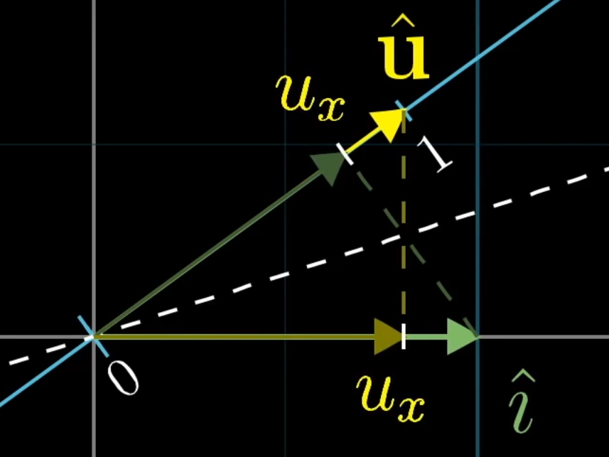
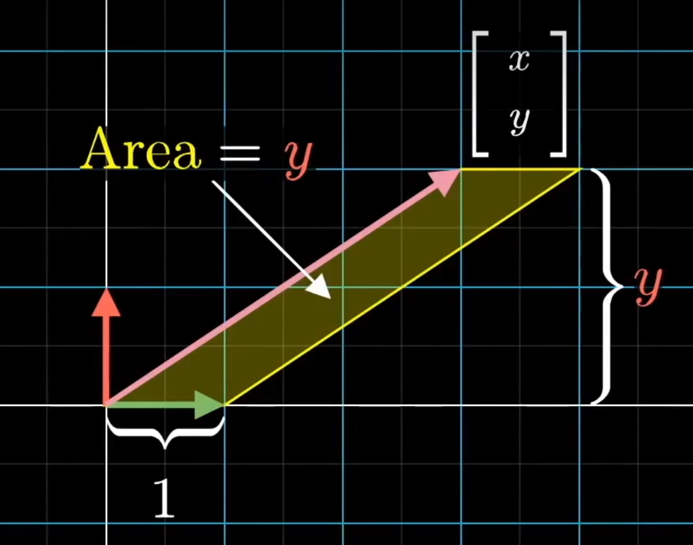
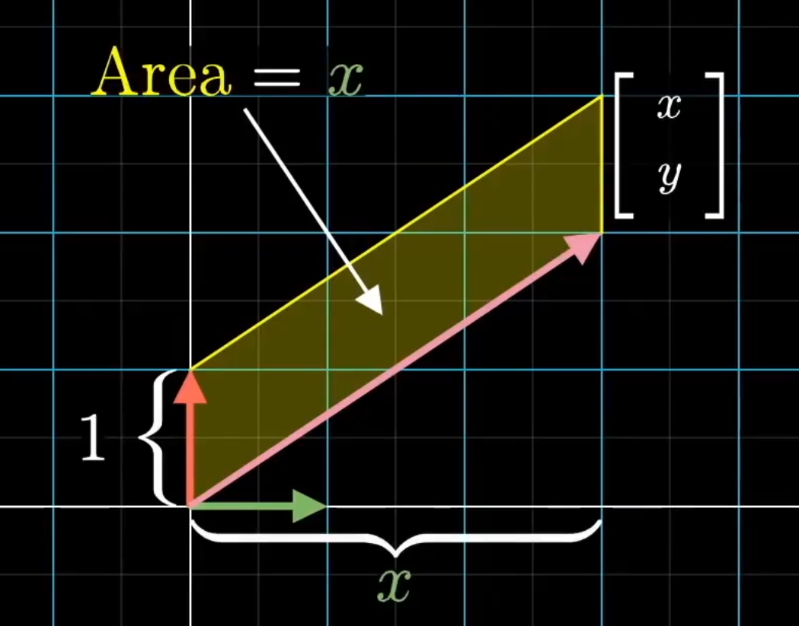
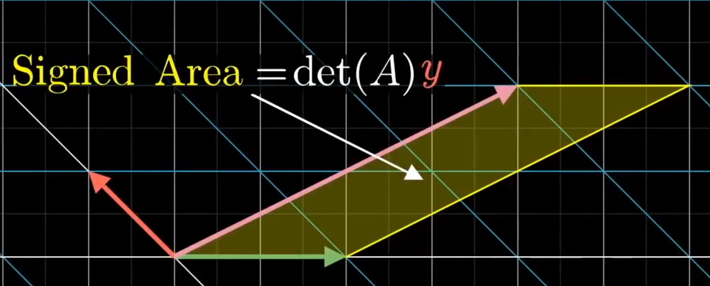
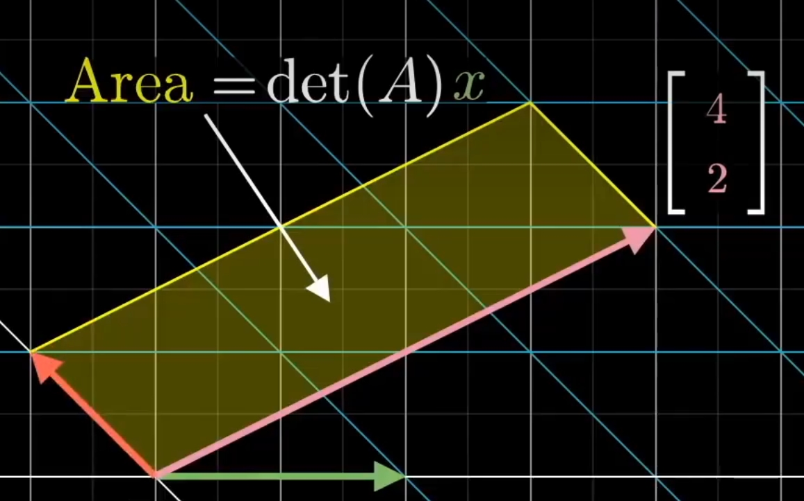

# 3b1b线性代数

[【官方双语/合集】线性代数的本质 - 系列合集_哔哩哔哩_bilibili](https://www.bilibili.com/video/BV1ys411472E/?spm_id_from=333.1387.collection.video_card.click&vd_source=e5aa67477135266ae5c66fe7c8b108f3)

## 1. 向量

在2维或3维中的坐标系中有方向的量，常用$\begin{bmatrix}x\\y\end{bmatrix}$或$\begin{bmatrix}x\\y\\z\end{bmatrix}$来表示以从原点向x轴移动x，y轴移动y，（z轴移动z）的有方向的量。

所以向量可以看成一种特定的运动，在空间中迈出一定距离，故==加法==是依次进两次特定的运动。
$$
\vec{v} = \begin{bmatrix}x_1\\y_1\end{bmatrix}\quad \vec{w} = \begin{bmatrix}x_2\\y_2\end{bmatrix}\quad \vec{v} + \vec{w} = \begin{bmatrix}x_1 + x_2 \\ y_1 + y_2\end{bmatrix}
$$
那==数乘==即“缩放”迈出的距离。
$$
k\vec v = \begin{bmatrix}kx_1\\ky_1\end{bmatrix}
$$

## 2. 线性组合、张成空间与基

$\hat{i}$与$\hat{j}$指两个沿x、y轴方向的单位向量，称它们是xy坐标系的“==基向量==”（也可以另找一对不重合的向量作为基）。

两个数乘向量的和被称为这两个向量的==线性组合==（线性一词可以这样看待：如果固定其中一个标量，即方向不变，让另一个标量自由变化，所产生的向量的终点会描出一条直线）。

所有可以表示为给定向量线性组合的向量的集合被称为给定向量“==张成的空间==”（若共线，张成的空间就是直线上的向量，若给定两者为零向量，那只能待在一个点了）。

只要保证起点位于原点，那就可以使用终点来抽象为向量，这样就不必考虑箭头了。

多个向量张成的空间中，可以移除一个向量而不减少张成的空间，我们就称它们“==线性相关==”，反之，若不可以，则“==线性无关==”。

## 3. 矩阵与线性变换

如果一个变换具有以下两条性质，我们就称它是线性的：一是空间中直线在变换后仍保持为直线，二是原点保持固定，这两点也就是说变换后“==保持空间中网格线平行且等距分布==”。

由线性变换得到一个推论：如果$\vec{v}$是$\hat{i}$和$\hat{j}$的一个线性组合，变换后的$\vec{v}$也是变换后$\hat{i}$和$\hat{j}$的同样的线性组合。

一个二维线性变换仅由四个数完全决定，它们是$\hat{i}$和$\hat{j}$变换后的坐标$\begin{bmatrix}a\\c\end{bmatrix}$和$\begin{bmatrix}b\\d\end{bmatrix}$，它们结合得到一个$\begin{bmatrix}a & b \\ c & d\end{bmatrix}$的矩阵。

根据推论，给定一个任意向量$\begin{bmatrix}x\\y\end{bmatrix}$，也就是
$$
x\hat{i} + y\hat{j} = x\begin{bmatrix}1\\0\end{bmatrix} + y\begin{bmatrix}0\\1\end{bmatrix}
$$

，你能得到变换后的它：
$$
x\begin{bmatrix}a\\c\end{bmatrix} + y\begin{bmatrix}b\\d\end{bmatrix} =\begin{bmatrix}ax + by \\ cx + dy\end{bmatrix} = \begin{bmatrix}a & b\\ c & d\end{bmatrix}\begin{bmatrix}x\\y\end{bmatrix}
$$
（注意是左乘，变换的本质类似函数）。

这是矩阵的==向量乘法==。

如果矩阵的列线性相关，即变换后的$\hat{i}$和$\hat{j}$线性相关，空间会被降维！

## 4. 矩阵乘法与线性变换复合

==矩阵之间的乘法==本质是复合变换，设
$$
M_1 = \begin{bmatrix}e & f\\ g & h\end{bmatrix}\quad M_2 = \begin{bmatrix}a & b \\ c & d\end{bmatrix}\quad M_1 \times M_2 = \begin{bmatrix}a & b \\ c & d\end{bmatrix}\begin{bmatrix}e & f \\ g & h\end{bmatrix}
$$
，经$M_2$变换后的$\hat{i}、\hat{j}$坐标分别为$\begin{bmatrix}e\\g\end{bmatrix}、\begin{bmatrix}f\\h\end{bmatrix}$，再经$M_1$后$\hat{i}、\hat{j}$的坐标分别为
$$
\begin{bmatrix}a & b \\ c & d\end{bmatrix}\begin{bmatrix}e\\g\end{bmatrix} = e\begin{bmatrix}a\\c\end{bmatrix} + g\begin{bmatrix}b\\d\end{bmatrix}、\begin{bmatrix}a & b \\ c & d\end{bmatrix}\begin{bmatrix}f\\h\end{bmatrix} = f \begin{bmatrix}a\\c\end{bmatrix} + f\begin{bmatrix}b\\d\end{bmatrix}
$$
，所以这个复合变换$M = M_1 \times M_2 = \begin{bmatrix}ea + gb & fa + hb \\ ec + gd & fc + hd\end{bmatrix}$。

（变换从右往左，和函数类似）

设$A、B、C$为三个变换，$AB \neq BA、(AB)C = A(BC)$。

## 附注1 三维空间中的线性变换

多加了一个$z$轴方向上的$\hat{k}$，三维空间中$\hat{i}、\hat{j}、\hat{k}$为一组基，其余的均与二维平面类似。

## 5. 行列式

经变换后网格线中的单位正方形面积的缩放比例，即线性变换改变面积的比例，称为该变换的==行列式==，记作$det\begin{pmatrix}\begin{bmatrix}a & b \\ c & d\end{bmatrix}\end{pmatrix}$（允许负值，负值意味着该空间翻转，空间方向发生改变）。

行列式为0说明它将整个平面压缩成点或者线。

三维空间则是体积的缩放比例。

一般三维空间的定向由“右手定则”给出，食指$\hat{i}$，中指$\hat{j}$，拇指$\hat{k}$。

## 6. 逆矩阵，列空间与零空间

我们可以给某个线性方程组给予几何意义，例如：
$$
\left\{\begin{align}
2x + 5y + 3z &= -3 \\
4x + 0y + 8z &= 0 \\
1x + 3y + 0z &= 2
\end{align}\right.
\quad
\Rightarrow
\quad
\begin{bmatrix}
2 & 5 & 3 \\
4 & 0 & 8 \\
1 & 3 & 0
\end{bmatrix}\begin{bmatrix}x\\y\\z\end{bmatrix} = \begin{bmatrix}-3\\0\\2\end{bmatrix}
$$
变换$A = \begin{bmatrix}
2 & 5 & 3 \\
4 & 0 & 8 \\
1 & 3 & 0
\end{bmatrix}$，向量$\vec{x} = \begin{bmatrix}x\\y\\z\end{bmatrix}$、$\vec{v} = \begin{bmatrix}-3\\0\\2\end{bmatrix}$，这线性方程组意味着$\vec{x}$经$A$变换后变成了$\vec{v}$。

而从$\vec{v}$变回$\vec{x}$的变换是$A$的反演，称为$A$的逆变换，记作$A^{-1}$，即$A$的==逆矩阵==，$A^{-1}\vec{v} = \vec{x}$。

注意仅$det(A) \neq 0$，也就是$A$变换没有压缩到低维的空间，才存在$A^{-1}$，因为低维反演至高维有很多种可能，一维直线如果被“解压缩”为一个二维平面，那在一维直线上的一个向量会被映射为很多个二维平面上的向量（在降维的过程中很多向量会被压缩成一个向量），相当于函数中一个输入对应多个输出了。

==秩==代表变换后空间的维数，若向量经变换后为一维则秩为1。

所有可能的变换结果的集合，被称为该变换的==列空间==，这个名字的由来是：一个矩阵的每个列告诉了我们变换后基向量的位置，变换后基向量张成的空间也就是列张成的空间也就是列空间。

所以列空间的维数为秩！

秩达到最大值称为==满秩==。

变换后落在原点向量的集合，被称为向量的“==零空间==”或“==核==”。

## 附注2 非方阵

$3 \times 2$的矩阵表示了二维平面在三维空间中的映射。

$2 \times 3$的矩阵则表示三维空间映射在二维平面中。

## 7. 点积与对偶性

对于一个单位向量$\hat{u} = \begin{bmatrix}u_{x}\\u_{y}\end{bmatrix}$，若把它看成一个$1 \times 2$的矩阵$\begin{bmatrix}u_{x} & u_{y}\end{bmatrix}$，该矩阵的意义是二维平面映射到一维直线上，如图所示，根据对称性，这个矩阵的作用相当于将$\hat{i}$投影到$\hat{u}$这个数轴的$u_x$处，同理$\hat{j}$也如此，那么这个二维平面上的向量作$\begin{bmatrix}u_{x} & u_{y}\end{bmatrix}$变换，即$\begin{bmatrix}u_{x} & u_{y}\end{bmatrix} \times \begin{bmatrix}x\\y\end{bmatrix}$，就是该向量在$\hat{u}$这个轴上作投影。

设$k\hat{u} = \begin{bmatrix}ku_{x}\\ku_{y}\end{bmatrix}$为非单位向量，看成$1 \times 2$的矩阵$\begin{bmatrix}ku_{x} & ku_{y}\end{bmatrix}$，作这个变换$\hat{i}$相当于投影到$\hat{u}$上再缩放$k$倍，$\hat{j}$同理，这与点积$k\hat{u} \cdot \hat{v} = \hat{u} = \begin{bmatrix}ku_{x}\\ku_{y}\end{bmatrix} \cdot \begin{bmatrix}x\\y\end{bmatrix}$一致，故点积可以解读为先在该向量上投影再将投影值与给定向量长度相乘。

这说明了点积与作变换具有自然又出乎意料的对应关系，在数学中，这称为==对偶性==。

## 8. 叉积

设计一个函数，给定一个三维向量$\begin{bmatrix}x\\y\\z\end{bmatrix}$可输出一个平行六面体的体积（行列式的几何意义）。
$$
\begin{bmatrix}p_1\\p_2\\p_3\end{bmatrix} \cdot \begin{bmatrix}x\\y\\z\end{bmatrix} = det\begin{pmatrix}\begin{bmatrix}x & v_1 & w_1 \\ y & v_2 & w_2 \\ z & v_3 & w_3\end{bmatrix}\end{pmatrix}
$$
其中$\vec{p} = \begin{bmatrix}p_1\\p_2\\p_3\end{bmatrix}、\vec{v} = \begin{bmatrix}v_1\\v_2\\v_3\end{bmatrix}、\vec{w} = \begin{bmatrix}w_1\\w_2\\w_3\end{bmatrix}$。

右式结果为$x(v_2w_3 - w_2v_3) + y(v_1w_3 - w_1v3) + z(v_1w_2 - w_1v_2)$，左式结果为$p_1x + p_2y + p_3z$，故知该函数中的$\vec{p} = \begin{bmatrix}v_2w_3 - w_2v_3 \\ v_1w_3 - w_1v_3 \\ v_1w_2 - w_1v_2\end{bmatrix}$由$\vec{v}、\vec{w}$的坐标给出。

一个有趣的想法：根据对偶性，把$\begin{bmatrix}p_1\\p_2\\p_3\end{bmatrix} \cdot \begin{bmatrix}x\\y\\z\end{bmatrix}$看成一个变换，$\begin{bmatrix}p_1 & p_2 & p_3\end{bmatrix} \cdot \begin{bmatrix}x\\y\\z\end{bmatrix}$所得结果都为数，即三维到一维的变换。

叉积的常用计算方式是：
$$
\vec{v} \times \vec{w} = det\begin{pmatrix}\begin{bmatrix}\hat{i} & v_1 & w_1 \\ \hat{j} & v_2 & w_2 \\ \hat{k} & v_3 & w_3\end{bmatrix}\end{pmatrix} = \hat{i}(v_2w_3 - w_2v_3) + \hat{j}(v_1w_3 - w_1v3) + \hat{k}(v_1w_2 - w_1v_2)
$$
从上面设计的函数给出的启发：右式为三个向量在空间中构成平行六面体的体积，也可以看成$\vec{v}、\vec{w}$所围成平行四边形的面积乘上$\begin{bmatrix}x\\y\\z\end{bmatrix}$在垂直该平行四边形方向的投影（高），左式为$\begin{bmatrix}x\\y\\z\end{bmatrix}$在$\vec{p}$上的投影乘上$\vec{p}$的长度，易知$\vec{p}$必然垂直于$\vec{v}、\vec{w}$所围成的平面且长度（模）等于该围成平行四边形的面积。

这个$\vec{p}$正是$\vec{v} \times \vec{w}$导出的结果。

## 9. 基变换

设空间中有两组基，一组是$\hat{i}、\hat{j}$，称系1，另一组在基于$\hat{i}$和$\hat{j}$所构建的系中的$\begin{bmatrix}2\\1\end{bmatrix}$和$\begin{bmatrix}-1\\1\end{bmatrix}$，称系2。

两套基独立给出了不同的坐标表达方式，它们构建了基于自身的坐标系。

在系2中$\begin{bmatrix}-1\\2\end{bmatrix}$表示的向量如何用系1的语言表示呢？

答案是$-1\begin{bmatrix}2\\1\end{bmatrix} + 2\begin{bmatrix}-1\\1\end{bmatrix} = \begin{bmatrix}2 & -1 \\ 1 & 1\end{bmatrix}\begin{bmatrix}-1\\2\end{bmatrix}$可以得到，因为线性变换后的向量仍旧是相同的线性组合。

那在系1中$\begin{bmatrix}3\\2\end{bmatrix}$表示的向量如何用系2的语言来表示呢？

$\begin{bmatrix}2 & -1 \\ 1 & 1\end{bmatrix}^{-1}\begin{bmatrix}3\\2\end{bmatrix}$，（$\begin{bmatrix}2 & -1 \\ 1 & 1\end{bmatrix}^{-1}$为系2到系1的变换矩阵）。

如何转化一个矩阵？

在系1中，我们用$\begin{bmatrix}0 & -1 \\ 1 & 0\end{bmatrix}$的旋转矩阵来表示系1逆时针旋转$90^{\circ}$，而系2不能做$\begin{bmatrix}0 & -1 \\ 1 & 0\end{bmatrix}$因为该矩阵跟踪的是$\hat{i}$和$\hat{j}$。那如何让系2做$90^{\circ}$旋转呢？给出用系2表示的向量$\vec{v}$，首先先用系1的语言表示$\vec{v}$，$\begin{bmatrix}2 & -1 \\ 1 & 1\end{bmatrix}\vec{v}$，然后就可以做$90^{\circ}$旋转，$\begin{bmatrix}0 & -1 \\ 1 & 0\end{bmatrix}\begin{bmatrix}2 & -1 \\ 1 & 1\end{bmatrix}\vec{v}$，最后再转化为系2语言表示：
$$
\begin{bmatrix}2 & -1 \\ 1 & 1\end{bmatrix}^{-1}\begin{bmatrix}0 & -1 \\ 1 & 0\end{bmatrix}\begin{bmatrix}2 & -1 \\ 1 & 1\end{bmatrix}\vec{v}
$$
此处$\begin{bmatrix}2 & -1 \\ 1 & 1\end{bmatrix}$称为==基变换==，$\begin{bmatrix}0 & -1 \\ 1 & 0\end{bmatrix}$是线性变换。三者复合便是另一组基所描述的线性变换矩阵，记作$A^{-1}MA$，暗示着数学中的转移作用。

## 第10先导知识

$$
A\vec{v} + M\vec{v} = (A + M)\vec{v}
$$

此处$A = \begin{bmatrix}a & b \\ c & d\end{bmatrix}、M = \begin{bmatrix}e & f \\ g & h\end{bmatrix}$，矩阵加法的定义为各元相加。

证明：

$\vec{v} = \begin{bmatrix}v_x\\v_y\end{bmatrix}$，故左式为：
$$
v_x\begin{bmatrix}a\\c\end{bmatrix} + v_y\begin{bmatrix}b\\d\end{bmatrix} + v_x\begin{bmatrix}e\\g\end{bmatrix} + v_y\begin{bmatrix}f\\h\end{bmatrix} = v_x\begin{bmatrix}a + e \\ c + g\end{bmatrix} + v_y\begin{bmatrix}b + f \\d + h\end{bmatrix} = \begin{bmatrix}a + e & b + f \\ c + g & d + h\end{bmatrix}\begin{bmatrix}v_x\\v_y\end{bmatrix}
$$
右式为：
$$
v_x\begin{bmatrix}a + e \\ c + g\end{bmatrix} + v_y\begin{bmatrix}b + f \\d + h\end{bmatrix}
$$
上式成立。

## 10. 特征向量与特征值

一些向量在进行线性变换后仍留在它们原先张成的空间中（向量张成的空间就是一条直线），那它们就是我们所说的特征向量，而它们在变换后缩放的比例就是特征值。

即$A\vec{v} = \lambda\vec{v}$，$\vec{v}$是特征向量，$\lambda$是特征值。

由$A\vec{v} = \lambda\vec{v}$（$\lambda$为$\vec{v}$的缩放，矩阵表示就是$\begin{bmatrix}\lambda & 0 & 0 \\ 0 & \lambda & 0 \\ 0 & 0 & \lambda\end{bmatrix}$，也就是$\lambda\begin{bmatrix}1 & 0 & 0 \\ 0 & 1 & 0 \\ 0 & 0 & 1\end{bmatrix}$，$\begin{bmatrix}1 & 0 & 0 \\ 0 & 1 & 0 \\ 0 & 0 & 1\end{bmatrix}$为单位阵$I$）。

得到$A\vec{v} - \lambda I\vec{v} = \vec{0}\Rightarrow (A - \lambda I)\vec{v} = \vec{0}$，若要使非零向量经线性变换后变成零向量，该变换必须要从高维降到低维，也就是$det(A - \lambda I) = 0$，这样可求得特征值，再代入前式求得特征向量（若无实数解表示无特征值，虚数解一般表示旋转变换）。

如果基向量都是特征向量，例如$\begin{bmatrix}3 & 0 \\ 0 & 2\end{bmatrix}$，基向量与特征向量均为$\hat{i}、\hat{j}$，这种矩阵也被称为==对角矩阵==。

对角矩阵多次与自己相乘方便计算，只需要特征值的多次幂就可以，例如100次相乘$\begin{bmatrix}3 & 0 \\ 0 & 2\end{bmatrix}\cdots \begin{bmatrix}3 & 0 \\ 0 & 2\end{bmatrix}\begin{bmatrix}x\\y\end{bmatrix} = \begin{bmatrix}3^{100} & 0 \\ 0 & 2^{100}\end{bmatrix}\begin{bmatrix}x\\y\end{bmatrix}$，因为对角矩阵仅仅让基向量与某个特征值相乘。

另外，若用特征向量作为基，例如$\begin{bmatrix}3 & 1 \\ 0 & 2\end{bmatrix}$这个变换的特征向量为$\begin{bmatrix}1\\0\end{bmatrix}$和$\begin{bmatrix}-1\\1\end{bmatrix}$，对应的基变换矩阵就为$\begin{bmatrix}1 & -1 \\ 0 & 1\end{bmatrix}$，再作转移作用$\begin{bmatrix}1 & -1 \\ 0 & 1\end{bmatrix}^{-1}\begin{bmatrix}3 & 1 \\ 0 & 2\end{bmatrix}\begin{bmatrix}1 & -1 \\ 0 & 1\end{bmatrix}$，该变换从新基向量构成的坐标系来看的。其结果必为对角阵，因为在$\hat{i}、\hat{j}$系作$\begin{bmatrix}3 & 1 \\ 0 & 2\end{bmatrix}$特征向量仅缩放不旋转，而转移操作只是转到新基构成的坐标系中，该新基正是仅缩放的特征向量，它被称为“==特征基==”。

如果要计算矩阵的多次幂，不如先转到特征基上，因为对角阵好算，例如某矩阵$A$，特征向量作基的基变换矩阵为$X$，则$X^{-1}AX$为转移作用，必为对角阵，记$\Lambda$，此时$\Lambda$是从新基角度看的变换，通过转移作用转到以$\hat{i}、\hat{j}$系，而特征基构成的系到$\hat{i}、\hat{j}$系的变换为$X^{-1}$，所以作转移作用应该为$XX^{-1}AXX^{-1}$，也就是$X\Lambda X^{-1}$，此时又变回从$\hat{i}、\hat{j}$来看，所以$A = X\Lambda X^{-1}$。计算$A^2 = X\Lambda X^{-1}X\Lambda X^{-1} = X\Lambda^{2}X^{-1}$，$A^{n}$同理。

注意，特征向量必须能张成全空间（完整的空间），不然没法作为基底。

## 11. 抽象向量空间

线性的严格定义：

可加性：$L(\vec{v} + \vec{w}) = L\vec{v} + L\vec{w}$

成比例：$L(c\vec{v}) = cL\vec{v}$

（$L$指某种线性变换）

巧妙的是，函数也有类似向量的操作方法，相加与数乘。

函数世界中与线代对应的：
$$
线性变换\rightarrow 线性算子
$$

$$
特征向量\rightarrow 特征函数
$$

同样的，数学中有很多类似向量的事物，只要处理的对象具有合理的数乘和相加概念，这些类似向量的事物构成的集合被称为“==向量空间==”。

数学家将向量创造出来并设定公理，以公理这个媒介与后世的我们相联系，我们得以将已有的结论用于这些类似向量的事物。所以向量的形式不重要，它可以是任意东西，只需要它遵守公理。为了向量概念有着更广泛的应用，不局限于空间的一个箭头，所以这也是教科书和课堂更倾向于抽象表述的根本原因。

**普适的代价是抽象**。

## 12. 克莱姆法则

例如：
$$
\left\{\begin{align}
2x + -y &= -4 \\
0x + y &= -2
\end{align}\right.\quad
\rightarrow \quad
\begin{bmatrix}2 & -1 \\ 0 & 1\end{bmatrix}\begin{bmatrix}x\\y\end{bmatrix} = \begin{bmatrix}-4\\-2\end{bmatrix}
$$
即求何输入向量经过$A$变换（$\begin{bmatrix}2 & -1 \\ 0 & 1\end{bmatrix}$）得到已知输出向量。

注意：结果需考虑是否降维，因为若降维即$det(A) = 0$，可能存在多个解或无解，高维多个向量会对应低维的同一个向量或输出向量不在降维后的空间中。

在$det(A) \neq 0$下：

通过线性变换的性质是保持网格线平行且等距分布可知，变换后所有任意处的面积等比例增大或缩小，其值等于给定的行列式$det(A)$。

给出一个巧妙的思路：

待求向量的y可用$det\begin{pmatrix}\begin{bmatrix}1 & x \\ 0 & y\end{bmatrix}\end{pmatrix}$表示：

x可用$det\begin{pmatrix}\begin{bmatrix}x & 0 \\ y & 1\end{bmatrix}\end{pmatrix}$表示：

那么这两块面积经$A$变换后的面积分别为$det(A)y = det\begin{pmatrix}\begin{bmatrix}2 & 4 \\ 0 & 2\end{bmatrix}\end{pmatrix}$（第一列为变后的基向量，第二列为变换后的输入向量）和$det(A)x = det\begin{pmatrix}\begin{bmatrix}4 & -1 \\ 2 & 1\end{bmatrix}\end{pmatrix}$（第一列为变换后的输入向量，第二列为变换后的基向量）

变换后的第一块
 

变换后的第二块
 

所以$y = \frac{det\begin{pmatrix}\begin{bmatrix}2 & 4 \\ 0 & 2\end{bmatrix}\end{pmatrix}}{det\begin{pmatrix}\begin{bmatrix}2 & -1 \\ 0 & 1\end{bmatrix}\end{pmatrix}}，x =\frac{det\begin{pmatrix}\begin{bmatrix}4 & -1 \\ 2 & 1\end{bmatrix}\end{pmatrix}}{det\begin{pmatrix}\begin{bmatrix}2 & -1 \\ 0 & 1\end{bmatrix}\end{pmatrix}}$

在三维中同样$z$可由$det\begin{pmatrix}\begin{bmatrix}1 & 0 & x \\ 0 & 1 & y \\ 0 & 0 & z\end{bmatrix}\end{pmatrix}$表示，x、y亦可类似表示，以上为克莱姆法则的几何解释。
